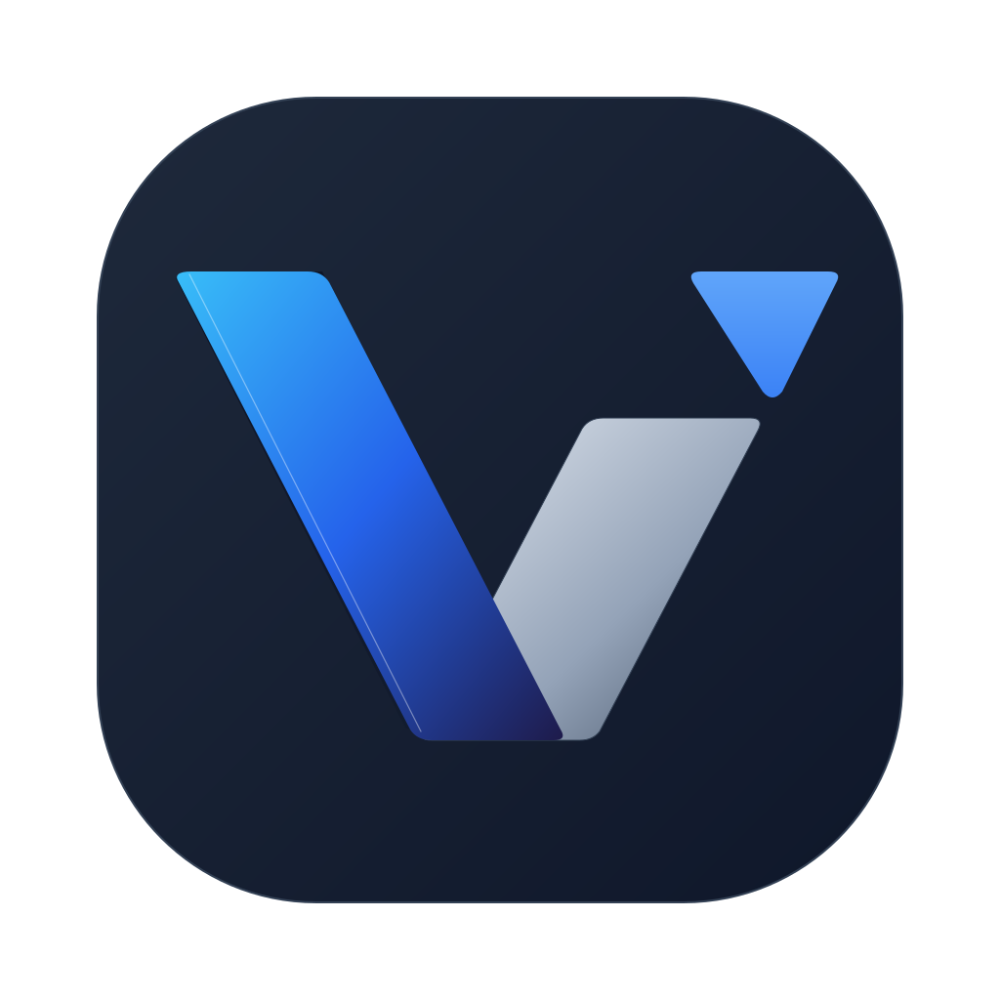
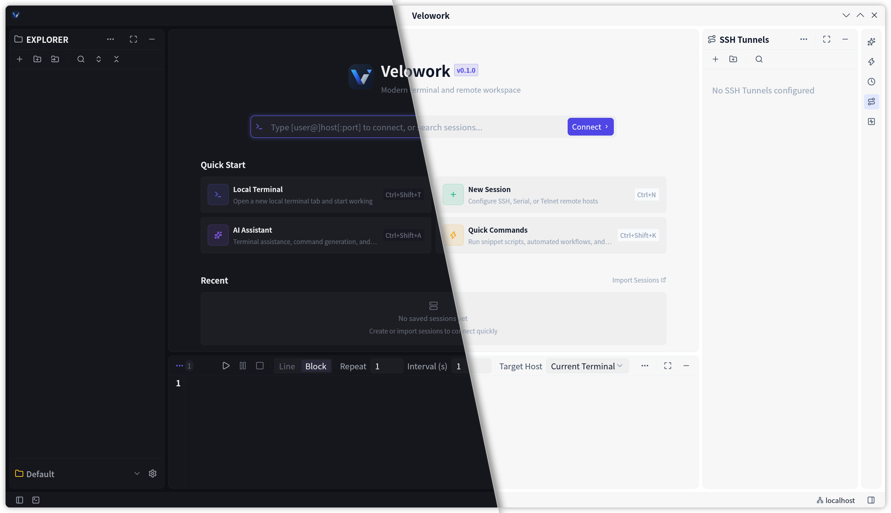

<p align="center">
  
</p>

<h1 align="center">Velowork</h1>

<p align="center">
  <em>A high-performance, native cross-platform terminal multiplexer and remote session workspace.</em>
</p>

<p align="center">
  <strong>Built with Rust and <a href="https://github.com/zed-industries/zed/tree/main/crates/gpui">GPUI</a> (the GPU-accelerated UI framework from the Zed editor).</strong><br/>
  <a href="https://github.com/mxsail/velowork"><strong>GitHub Repository</strong></a> ·
  <a href="https://github.com/mxsail/velowork/wiki"><strong>Documentation</strong></a> ·
  <a href="https://github.com/mxsail/velowork/releases"><strong>Releases</strong></a>
</p>

<p align="center">
  SSH, local shells, SFTP browser, quick commands, tunnels, AI tool integration, and workspace persistence in one native desktop client.
</p>

<p align="center">
  <a href="https://github.com/mxsail/velowork/releases"></a>
  &nbsp;
  <a href="https://github.com/mxsail/velowork/releases"></a>
  &nbsp;
  <a href="#"></a>
  &nbsp;
  <a href="#"></a>
  &nbsp;
  <a href="LICENSE"></a>
</p>

<p align="center">
  <a href="./README.md">English</a> · <a href="./README_zh.md">简体中文</a>
</p>

<p align="center">
  
</p>

---

## 🌟 Overview

**Velowork** is a brand-new native remote terminal workstation and management client built upon [Okena](https://github.com/contember/okena). It unifies remote server fleet management, local multi-shell terminals, industrial multi-protocol connections, background service orchestration, SSH tunnels, and dual-pane SFTP workflows into a cohesive, high-performance environment, reimagining the daily terminal experience with handcrafted modern native UI aesthetics and fluid visual details.

- ⚡ **Buttery 120 FPS GPU Rendering** — Built purely in Rust on GPUI with sub-millisecond input response, instant cold starts, and minimal memory footprint (`jemalloc` / `mimalloc`).
- 🌐 **Unified Remote & Local Workspace** — Manage SSH hosts, jump hosts, port tunnels, SFTP transfers, and local shells side-by-side with tabs, splits, and detachable floating windows.
- 🔄 **Resilient Session Persistence** — Keep remote and local sessions alive across network dropouts or app restarts via native persistence backends (`dtach`, `tmux`, `screen`, and Windows WSL).
- 🤖 **AI Copilot (Early Preview / In Progress)** — Initial integration with multi-provider LLMs (Claude, OpenAI, DeepSeek, Ollama) for natural language shell command generation and sidebar chat. Currently in an early iteration stage with ongoing active development.
- 📊 **Real-time System & Service Monitoring** — Live CPU, RAM, Disk I/O, and Network throughput meters; graphical Services Panel for monitoring Systemd units, Docker containers, and custom command services with health checks and start/stop/restart controls.
- 🔐 **Local-First Security & Credential Vault** — Master-password protected credential store with OS keyring integration and encrypted AES-256-GCM sync bundles.

---

## 🚀 Key Features

### 🪟 Layout & Workspace Management
- **Interactive Split Panes** — Horizontal and vertical splits with interactive drag-to-resize dividers.
- **Tabbed Containers & Docking** — Organize terminals into tab groups with drag-and-drop reordering; collapsible left/right/bottom docks.
- **Multiple Tab Width Modes** — Support for Equal, Compact, and TitleLength adaptive modes to suit various multitasking workflows.
- **Tab Hover Snapshot Previews** — Hovering over inactive tabs reveals a translucent snapshot card displaying live terminal state, connection protocol, and session details.
- **Detachable Windows** — Pop out any terminal into an independent floating window and reattach on demand.
- **Multi-Project Columns** — Manage multiple project environments side-by-side with resizable columns.
- **Automatic State Persistence** — Debounced auto-save restores your complete workspace layout, terminal scrollback, open tabs, and settings on startup.

### 💻 Terminal Experience
- **Full Terminal Emulation** — Powered by `alacritty_terminal` with complete 24-bit TrueColor ANSI support and Sixel/image support.
- **Immersive Terminal Wallpaper** — Custom background images with adaptive Gaussian blur scrims and translucent tab bar protection, balancing personalization with high-contrast readability.
- **ZMODEM File Transfer** — Native ZMODEM integration: run `rz` / `sz` directly inside the terminal to trigger GUI file pickers for high-speed file transfers.
- **Inline Text Search** — Fast search with regex support, case matching, and occurrence counts.
- **Smart Link Detection & Editor Jump** — Clickable URLs, IP addresses, and file paths with `file:line:col` syntax to directly open files in VS Code, Cursor, Zed, Sublime, or Neovim.
- **Bracketed Paste & Image Paste** — Multi-line paste injection protection, plus direct clipboard image pasting into TUIs.
- **Per-Terminal Shell Selection** — Assign different shells per terminal (`bash`, `zsh`, `fish`, `cmd.exe`, `PowerShell`, `WSL`).
- **Deep Scrollback & Visual Bell** — Configurable scrollback buffer up to 100,000 lines with visual and audible bell indicators.

### 🌐 Multi-Protocol Remote Fleet Management
- **Connection Tree** — Folder hierarchies, custom tags, custom color icons, and one-click quick connect.
- **Serial Port (UART/RS-232)** — Direct connection to physical and USB serial ports with automatic device detection and standard baud rate selection.
- **Telnet Protocol** — Native Telnet terminal sessions for switch/router debugging and legacy remote systems.
- **X11 Forwarding** — Integrated SSH X11 graphics forwarding to display remote GUI windows directly on your local desktop.
- **ProxyJump & Jump Hosts** — Multi-hop bastion host routing and SSH key passphrase caching.
- **SSH Tunnels & Port Forwarding** — Graphical manager for Local (`-L`), Remote (`-R`), and Dynamic SOCKS5 (`-D`) tunnels.
- **SFTP File Browser** — Dual-pane file manager with drag-and-drop upload/download, remote file preview, and remote file editing.
- **Quick Commands & Snippets** — Pre-configured command templates with interactive `{{variable}}` parameter modal inputs.

### 🔄 Session Persistence
- **Zero-Downtime Reconnection** — Automatic multi-backend session recovery via `dtach`, `tmux`, or `screen` (Unix).
- **Windows WSL Session Recovery** — Transparent session persistence for Windows WSL environments.
- **Named Session Profiles** — Save, restore, import, and export named workspace layouts and session presets.

### 🤖 AI Assistant (Early Preview / In Progress)
- **AI Sidebar Panel** — Built-in AI chat panel with context from active terminals and project files.
- **Natural Language to CLI** — Convert plain English descriptions into shell commands with one-click execution.
- **Multi-Model Provider Support** — Connect to Claude, OpenAI, DeepSeek, Ollama, or custom OpenAI-compatible endpoints.
> 💡 **Note**: AI features are currently in an initial preview stage and are being actively enhanced for deeper terminal workflow synergy.

### 📊 System & Service Monitoring
- **Live Hardware Status Bar** — Real-time CPU, RAM, Disk I/O, Network traffic, and system clock.
- **Custom Services Panel** — Manage and monitor Systemd units, Docker containers, and custom command services with health checking and one-click start/stop/restart.

### 🎨 Customization & Internationalization
- **Handcrafted Design System** — Unified Design Tokens, semantic palettes, concentric geometry, and smooth micro-motions for visual consistency.
- **Platform-Native Titlebar Presets** — Switch between a custom in-app titlebar and OS-native decorations, with presets for macOS Traffic Lights, Windows 11, Linux CSD, and KDE Breeze.
- **Theme Engine** — Built-in Dark, Light, Pastel Dark, and High Contrast themes, plus custom JSON theme loading.
- **Complete Bilingual i18n** — English and Simplified Chinese localization with tooltip hints on every icon.

---

## 🏗️ Architecture

Velowork is architected as a modular Cargo workspace of 17 specialized crates:

```
velowork (Binary Entry Point)
  ├── velowork-app (Desktop Application Layer: Windows, Menus, Overlays, Actions)
  │     ├── velowork-views-terminal (Views: Terminal Panes, SFTP Browser, Dialogs, Sidebar)
  │     ├── velowork-ui (UI Components: Tokens, Buttons, Inputs, Dialogs, Tabs)
  │     │     ├── velowork-theme (Theme Engine & Semantic Palette)
  │     │     └── velowork-core (Core Types, Process Management, Git Integration)
  │     ├── velowork-layout (Dock & Pane Layout Primitives)
  │     ├── velowork-state (Reactive State Management & Service Monitoring)
  │     ├── velowork-workspace (Workspace GPUI Entity, Persistence, Project State)
  │     ├── velowork-terminal (PTY Spawn Loop, Shell Detection, Session Engines)
  │     ├── velowork-security (Master Password, Vault & OS Keyring Integration)
  │     ├── velowork-ai (AI Assistants, LLM Providers, NL-to-CLI)
  │     ├── velowork-monitor (Hardware & System Resource Metrics)
  │     ├── velowork-markdown (Markdown Parser & Documentation Viewer)
  │     ├── velowork-i18n (Embedded Translations & i18n! Macro)
  │     ├── velowork-extensions (Extension & Plugin Runtime)
  │     └── velowork-updater (Cryptographically Verified Auto-Updater)
```

| Crate | Responsibility |
| :--- | :--- |
| `velowork-app` | Desktop app layer: window lifecycle, menus, overlay coordinator, keybinding routing |
| `velowork-app-core` | App core domain models, interfaces, and shared state bridges |
| `velowork-workspace` | LayoutNode tree, multi-pane docking, workspace persistence, settings state |
| `velowork-views-terminal` | Terminal pane views, SFTP browser, tunnel and remote connection dialogs, sidebar |
| `velowork-terminal` | PTY spawn loop, shell detection, session persistence engines (`dtach`/`tmux`/`screen`) |
| `velowork-layout` | Dock, panel, and split layout primitives |
| `velowork-state` | State store, reactive state models, service monitor definitions, and event channels |
| `velowork-ui` | Design tokens, icons, handcrafted modern UI component library (`Button`, `SimpleInput`, `Tab`, etc.) |
| `velowork-theme` | Color definitions, theme resolution, and semantic color palette mapping |
| `velowork-security` | Master password encryption, OS keyring integration, and credential vault |
| `velowork-ai` | AI copilot integration, LLM providers, and natural language command generator |
| `velowork-monitor` | Real-time hardware and system metrics (CPU, RAM, Disk, Network) |
| `velowork-markdown` | Markdown rendering engine, document viewer, and syntax highlighter |
| `velowork-i18n` | Embedded JSON translations, locale loader, and `i18n!` macro |
| `velowork-core` | Shared data types, wire protocols, git diff parsing, worktree operations |
| `velowork-extensions` | Extension runtime and plugin architecture |
| `velowork-updater` | Background auto-updater with cryptographic verification |

---

## ⌨️ Keyboard Shortcuts

> All shortcuts are context-aware and customizable via `keybindings.json`.

| Action | macOS | Linux / Windows | Scope / Context |
| :--- | :--- | :--- | :--- |
| **Command Palette** | `Cmd+Shift+P` | `Ctrl+Shift+P` | Global |
| **Focus Left Dock (Sessions)** | `Cmd+1` | `Alt+1` | Global |
| **Focus Center Dock (Terminal)** | `Cmd+2` | `Alt+2` | Global |
| **Focus Bottom Dock (SFTP / Commands)** | `Cmd+3` | `Alt+3` | Global |
| **Focus Right Dock (AI / Tools)** | `Cmd+4` | `Alt+4` | Global |
| **Toggle Left Dock** | `Cmd+B` | `Ctrl+B` | Global |
| **Toggle Right Dock** | `Cmd+Shift+R` | `Ctrl+Shift+R` | Global |
| **AI Assistant Panel** | `Cmd+Shift+A` | `Ctrl+Shift+A` | Global |
| **SSH Tunnels Panel** | `Cmd+Shift+U` | `Ctrl+Shift+U` | Global |
| **Services Panel** | `Cmd+Shift+S` | `Ctrl+Shift+S` | Global |
| **Quick Commands Panel** | `Cmd+Shift+K` | `Ctrl+Shift+K` | Global |
| **SFTP File Browser** | `Cmd+Shift+F` | `Ctrl+Shift+F` | Global |
| **Bottom Commands Panel** | `Cmd+Shift+Y` | `Ctrl+Shift+Y` | Global |
| **Command History Panel** | `Cmd+Shift+H` | `Ctrl+Shift+H` | Global |
| **Equalize Layout** | `Cmd+Alt+E` | `Ctrl+Alt+E` | Global |
| **New Window** | `Cmd+Shift+N` | `Ctrl+Shift+N` | Global |
| **Settings** | `Cmd+,` | `Ctrl+,` | Global |
| **Keybindings Reference** | `Cmd+K Cmd+S` | `Ctrl+K Ctrl+S` | Global |
| **Theme Selector** | `Cmd+K Cmd+T` | `Ctrl+K Ctrl+T` | Global |
| **New Terminal Tab** | `Cmd+T` | `Ctrl+Shift+T` | Terminal |
| **Split Vertical** | `Cmd+D` | `Ctrl+Shift+D` | Terminal |
| **Split Horizontal** | `Cmd+Shift+D` | `Ctrl+D` | Terminal |
| **Close Active Tab** | `Cmd+W` | `Ctrl+Shift+W` | Terminal |
| **Find in Terminal** | `Cmd+F` | `Ctrl+F` | Terminal |
| **Copy / Paste** | `Cmd+C` / `Cmd+V` | `Ctrl+Shift+C` / `Ctrl+Shift+V` | Terminal |
| **Zoom In / Out** | `Cmd+=` / `Cmd+-` | `Ctrl+=` / `Ctrl+-` | Terminal |

---

## 🛠️ Building & Installation

### Prerequisites

- **Rust Toolchain**: **1.95.0** (pinned in `rust-toolchain.toml`, Edition 2024).
- **C Toolchain & Build Tools**: `cmake`, `pkg-config`, and a C/C++ compiler.

#### Linux System Dependencies
On Debian / Ubuntu:
```bash
sudo apt update
sudo apt install -y build-essential pkg-config libx11-dev libxkbcommon-x11-dev \
    libfontconfig1-dev libwayland-dev libssl-dev cmake
```

On Fedora / RHEL:
```bash
sudo dnf install -y gcc gcc-c++ pkgconfig libX11-devel libxkbcommon-x11-devel \
    fontconfig-devel wayland-devel openssl-devel cmake
```

### Build from Source

```bash
# Clone the repository
git clone https://github.com/mxsail/velowork.git
cd velowork

# Build optimized release binary
cargo build --release

# Run Velowork
./target/release/velowork
```

### Windows Build

On Windows, run from the **x64 Native Tools Command Prompt for VS 2022**:

```powershell
cargo build --release --target x86_64-pc-windows-msvc
# Output binary: target\x86_64-pc-windows-msvc\release\velowork.exe
```

### Profiling Build

To generate heap profiling data using `dhat`:

```bash
cargo run --profile profiling --features dhat-heap
```

---

## ⚙️ Configuration & Profile Storage

Velowork uses a profile-isolated storage model. Platform configuration paths:

- **macOS**: `~/Library/Application Support/velowork/`
- **Linux**: `~/.config/velowork/`
- **Windows**: `%APPDATA%\velowork\`

### Directory Structure

```text
<config-dir>/velowork/
├── profiles/
│   └── default/
│       ├── manifest.json
│       ├── config/
│       │   ├── settings.json       # General settings (appearance, terminal, AI, sync, proxy)
│       │   └── keybindings.json    # User-defined keyboard shortcuts
│       ├── data/
│       │   └── velowork.db         # SQLite database (hosts, sessions, services, history)
│       └── themes/                 # Custom JSON themes
├── logs/                           # Per-profile application logs
└── runtime/                        # Sockets, IPC, and PID locks
```

---

## 📖 Documentation & Resources

- [Getting Started Guide](https://github.com/mxsail/velowork/wiki/Getting-Started)
- [SSH & Remote Configuration](https://github.com/mxsail/velowork/wiki/SSH-Configuration)
- [Quick Commands & Variable Syntax](https://github.com/mxsail/velowork/wiki/Quick-Commands)
- [Custom Themes & Fonts](https://github.com/mxsail/velowork/wiki/Custom-Themes)
- [Keybindings Guide](docs/shortcuts.md)

---

## 🤝 Contributing

Contributions are welcome! Code submissions and pull requests must strictly adhere to the project's [Core Architecture & Contributing Constitution](CONSTITUTION.md).

```bash
# Run tests across all workspace crates
cargo test

# Run fast typecheck
cargo check
```

---

## 💡 Development Story & Authorship

### Why Reinvent the Wheel?
Throughout daily systems administration and development workflows, existing terminal and SSH client solutions consistently fell short of personal expectations:
- **Aesthetic Mismatch with Native Desktops**: As a user working primarily across **KDE Plasma (Breeze theme)** and **Windows 11**, most existing terminal tools feel visually disconnected and clunky compared to the sleek aesthetic of modern desktop environments.
- **Pseudo-Lightweight & Hidden Resource Bloat**: While several modern tools advertise themselves as "built with Rust," many are fundamentally wrappers around web technologies (Tauri / Webviews). Despite the marketing, prolonged usage with high-throughput log streams and multiple split panes inevitably leads to noticeable memory bloat and UI lag.
- **Friction in Daily Workflows (Quick Commands / Snippets)**: In routine operations, many commands have fixed prefixes while arguments require dynamic inputs based on real-time context. Most terminal managers either only support rigid full-line snippets or lack intuitive interactive variable placeholders (e.g., `{{variable}}`), resulting in constant back-and-forth manual text editing.

After extensive technical evaluation, the combination of **Rust + GPUI** emerged as the definitive solution: true native compilation guarantees rock-solid memory efficiency, while GPU-accelerated rendering delivers sub-millisecond 120 FPS smoothness.

### A Novice's "Vibe Coding" Paradigm
However, as a creator with **zero prior Rust development experience**, tackling a complex desktop application with Rust's steep learning curve seemed nearly impossible. I chose to embrace the frontier paradigm of **Vibe Coding**:
- **The Human's Role**: Guided strictly by personal daily habits, aesthetic standards, and real workflow friction points, I focused exclusively on product vision, feature architecture, UX design, and functional requirements.
- **100% AI Code Authoring**: 100% of the Rust codebase across the entire repository—terminal multiplexing, GPUI view trees, platform abstractions, and CI/CD pipelines—was authored by AI.
  - Early prototyping and feasibility experiments were assisted by tools like **mimocode** and **codebuddy**;
  - As the project scaled, all daily engineering, complex refactoring, bug fixes, and release management transitioned fully to **Google Antigravity** (powered by the **Gemini** model).

### Embracing Bugs & Building Together
Because the codebase is entirely AI-generated and rapidly evolving, encountering edge cases and bugs is completely natural and expected.

- **Bugs Are Expected**: If you run into any quirks, crashes, or unexpected behavior, please don't hesitate to open an [Issue](https://github.com/mxsail/velowork/issues). I will promptly feed the diagnostics to Antigravity for investigation and resolution.
- **Feature Ideas & Feedback Welcome**: If you have creative ideas, workflow improvements, or feature suggestions that could make Velowork even more powerful and enjoyable, your feedback is warmly welcomed!

---

## 📄 License, Acknowledgments & Disclaimer

### 📜 License
Released under the [AGPLv3 License](LICENSE). Copyright © 2026 Velowork Team.

### 💖 Acknowledgments
Velowork stands on the shoulders of fantastic open-source projects and AI innovations:

- **[Google Antigravity & Gemini](https://deepmind.google/technologies/gemini/)** — For the primary AI pair-programming and agentic engineering capabilities powering ongoing development.
- **[Okena](https://github.com/contember/okena)** — Velowork is developed based on Okena. We are deeply grateful to the Okena team for their pioneering work on GPUI-powered terminal multiplexing, workspace layout, and core architecture.
- **[GPUI (Zed)](https://github.com/zed-industries/zed)** — For the blazing-fast, GPU-accelerated UI framework powering sub-millisecond 120 FPS rendering.
- **[Alacritty](https://github.com/alacritty/alacritty)** — For the robust, high-performance terminal emulation backend.
- **Early AI Toolings** — Thanks to **mimocode** and **codebuddy** for their assistance during early prototyping.
- **The Rust Community** — For the rich ecosystem of crates (`tokio`, `smol`, `portable-pty`, `serde`, `keyring`, etc.) that make native systems development reliable and performant.

### ⚠️ Disclaimer
- **As-Is Provision**: Velowork is an open-source project shared in good faith under the AGPLv3 license. It is provided "AS IS" without warranties of any kind.
- **AI-Assisted Notice**: The codebase is generated and iterated with AI assistance. While automated tests and quality checks are maintained, please test in non-critical environments before relying on it for important workloads.
- **User Discretion**: When connecting to remote servers via SSH or executing system commands, please handle credentials responsibly and practice routine backups. Users assume normal discretion and responsibility for their own terminal operations and remote sessions.
